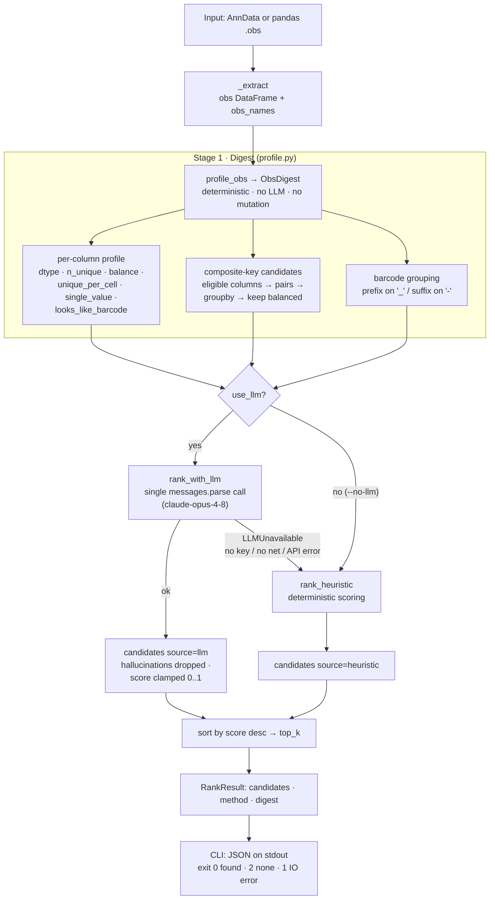

# stansample

Rank which AnnData `.obs` column — or composite key, or barcode-derived
grouping — identifies the **sample** each cell came from (the natural grouping
unit for per-sample QC, batch grouping, or pseudobulk). It **ranks**; it does
not decide.

Primary path: a single structured LLM call (`claude-opus-4-8`) over a compact,
deterministic digest of `.obs`. With no API key or no network, it falls back to
a deterministic heuristic ranker over the same digest — so it always returns an
answer offline.

The CLI speaks **JSON only** — stdout is always a single JSON object, ready to
pipe into `jq` or load in another program.

## Install

```bash
pip install -e .            # core + heuristic only
pip install -e ".[llm]"     # add the LLM path (anthropic)
pip install -e ".[anndata]" # add .h5ad reading / AnnData inputs
```

The LLM path reads `ANTHROPIC_API_KEY` from the environment.

## CLI

```bash
stansample sample.h5ad              # LLM if key present, else heuristic
stansample sample.h5ad --no-llm     # force offline heuristic
stansample sample.h5ad --top 0      # all candidates (default: top 5)
python -m stansample sample.h5ad    # equivalent module form
```

| Flag | Default | Meaning |
|---|---|---|
| `--no-llm` | off | force the offline heuristic ranker (no API call) |
| `--top K` | `5` | keep the K highest-scored candidates; `0` = all |
| `--model ID` | `claude-opus-4-8` | LLM model id for the primary path |

## Output

The CLI emits **one JSON object on stdout** — always, including when nothing is
found (`candidates` is then `[]`). Diagnostics for unreadable files go to
**stderr**, not stdout, so a consumer can parse stdout whenever the exit code is
`0` or `2`.

```jsonc
{
  "method": "heuristic",            // "llm" | "heuristic" | "heuristic (llm unavailable: …)"
  "candidates": [                   // sorted by score, highest first; length ≤ --top
    {
      "column": "sample",           // .obs column; composite is "a + b"; barcode is "<barcode:prefix:_>"
      "kind": "single",             // "single" | "composite" | "barcode"
      "score": 0.8820472360312052,  // 0..1, full precision
      "reason": "name match=1.0, n_unique=3, balance=0.53",  // one-line justification
      "source": "heuristic"         // "llm" | "heuristic" — which ranker produced this row
    }
  ]
}
```

| Field | Type | Notes |
|---|---|---|
| `method` | string | Which path ran end-to-end; the `heuristic (llm unavailable: …)` form names why the LLM was skipped. |
| `candidates[]` | array | May be empty. Each element is one ranked entry, in descending `score`. |
| `candidates[].column` | string | The entry's label: a column name, a `"a + b"` composite, or a `"<barcode:POSITION:DELIM>"` barcode grouping. |
| `candidates[].kind` | enum | `single`, `composite`, or `barcode`. |
| `candidates[].score` | float | Confidence in `0..1` (full precision; not rounded). |
| `candidates[].reason` | string | Human-readable one-liner explaining the score. |
| `candidates[].source` | enum | `llm` or `heuristic` — the ranker that emitted this row. |

**Exit codes:** `0` ≥ 1 candidate · `2` none found (still valid JSON on stdout) ·
`1` IO error (message on stderr).

```bash
# e.g. take the single best column name, or empty if none:
stansample sample.h5ad --no-llm | jq -r '.candidates[0].column // empty'
```

## Library

```python
from stansample import rank_sample_columns

res = rank_sample_columns(adata)          # or pass a pandas .obs DataFrame
for c in res.candidates:                  # sorted by score, top 5 by default
    print(c.score, c.kind, c.column, "—", c.reason)
print(res.method)                         # "llm" or "heuristic (...)"
best = res.top()                          # highest-scored; you decide whether to use it
```

`rank_sample_columns(data, *, use_llm=True, model="claude-opus-4-8", client=None, top_k=5)`.
Never mutates the input; writes no files.

## How it works

The pipeline is **profile → rank → fall back → report**. A single deterministic
*digest* of `.obs` is built once, then handed to one of two interchangeable
rankers. The LLM never sees raw cell data — only the compact digest — so the
call is cheap, private, and reproducible, and the offline heuristic scores the
*exact same* digest when the LLM is unavailable.



### Stage 1 — Digest (`profile.py`, deterministic)

`profile_obs(obs, obs_names)` reduces `.obs` to an `ObsDigest` with three kinds
of candidates. It reads only `.obs` (the CLI opens `.h5ad` with `backed="r"`),
never mutates input, and makes no network call.

**Per-column profile** — for every `.obs` column:

| Feature | Meaning |
|---|---|
| `dtype` | `categorical` / `string` / `integer` / `float` / `bool` |
| `n_unique`, `n_missing` | distinct non-null values, missing count |
| `balance` | `min_group / max_group` cells — 1.0 = perfectly even |
| `unique_per_cell` | `n_unique == n_obs` → a cell ID, **not** a sample |
| `single_value` | `n_unique <= 1` → one batch, nothing to split |
| `looks_like_barcode` | >50% of values match `^[ACGTN]{8,}(-\d+)?$` |

**Composite keys** — columns that are individually too coarse can jointly
identify a sample. Eligible columns (not unique-per-cell, not single-value, not
barcode, `2 ≤ n_unique ≤ 0.5·n_obs`) are paired; each pair is `groupby`-counted,
kept only if it forms `2 ≤ groups < n_obs`, and ranked by balance. Work is
bounded to the 12 most balanced columns (the `O(k²)` guard) and the 8 best pairs.

**Barcode grouping** — when the sample lives only in the cell name
(`obs_names`): a `_` prefix (`OA1_AAAC…` → `OA1`) if >90% of names contain `_`,
or a numeric `-` suffix (`AAAC…-1` → `1`) if >90% of tails are digits. The
grouping is kept only if it yields `2 ≤ groups < n_obs`; the most balanced wins.

### Stage 2 — Rank (two paths, same digest)

**LLM path** (`llm.py`) — one structured `client.messages.parse` call against
`claude-opus-4-8`. The system prompt frames the task (*identify the sample
grouping unit*) and supplies name hints; the user prompt is the digest as JSON.
The reply is validated against the real candidate labels — **any column the
model invents is dropped**, scores are clamped to `0..1`, and each candidate's
`kind` is taken from the digest, not the model. Missing key, missing network,
missing `anthropic`, API error, or unparseable output all raise `LLMUnavailable`
→ automatic fallback.

**Heuristic path** (`heuristic.py`) — deterministic, offline. Single columns
(skipping single-value and unique-per-cell) score:

```
score = 0.5·name_signal + 0.25·cardinality_signal + 0.25·balance − penalties   (clamped 0..1)
```

| Term | Value |
|---|---|
| `name_signal` | `1.0` exact alias (`sample`, `donor`, `orig.ident`, `gsm`, `batch`, …) · `0.6` alias substring · else `0.0` |
| `cardinality_signal` | `0.0` if `n_unique < 2` · `1.0` if `n_unique ≤ max(50, 0.2·n_obs)` · else `0.3` |
| `balance` | the digest's `min/max` group ratio |
| `penalties` | `+0.5` float · `+0.5` barcode-looking · `+0.3` if >50% missing |

Composite keys use the member-averaged name signal with a 15% discount
(`×0.85`); the barcode grouping scores `0.45·balance + 0.1`. Candidates scoring
`≤ 0` are dropped.

### Stage 3 — Report (`rank.py` → CLI)

Candidates from whichever path ran are sorted by score (desc) and truncated to
`top_k` (`top_k=0`/`None` ⇒ all). The result carries `method` (`"llm"` or
`"heuristic (llm unavailable: …)"`) so you always know which path produced it.
The CLI serializes this to a single JSON object on stdout (see
[Output](#output)); the library hands back a `RankResult`, whose `.top()`
returns the single best candidate — **but the tool ranks; you decide whether to
trust the pick.**
